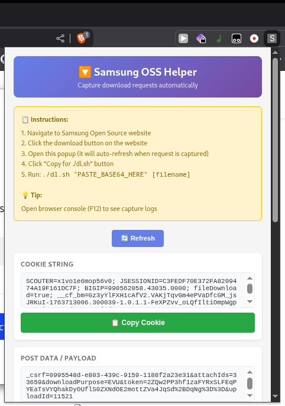
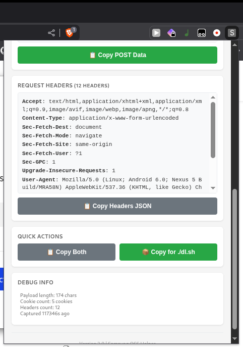

# Samsung OSS Downloader

A Chrome extension and bash script to automate downloading source code from Samsung's Open Source website.

📸 Screenshots (Click to expand)

## Requirements

- Chromium-based browser (Chrome, Brave)
- Linux with `curl` installed
- `jq` or `python3` (for header parsing)

## Installation

1. Download the extension from [releases](https://github.com/ravindu644/samsung-oss-downloader/releases) and extract it
2. Go to your browser's extension page
3. Enable **Developer mode** and click **"Load unpacked"**
4. Select the extracted extension folder
5. Make `dl.sh` executable: `chmod +x dl.sh`

## Usage

1. Go to https://opensource.samsung.com and search for source code
2. Select the source code, solve the CAPTCHA, and press the download button. (You can cancel the download once the request is captured)
3. Open the extension popup and click **"📦 Copy for ./dl.sh"**
4. Run: `./dl.sh "PASTE_BASE64_HERE" [filename]`
